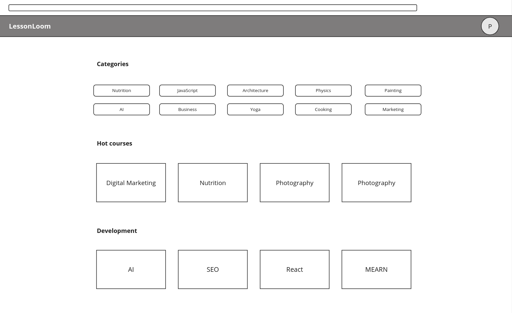
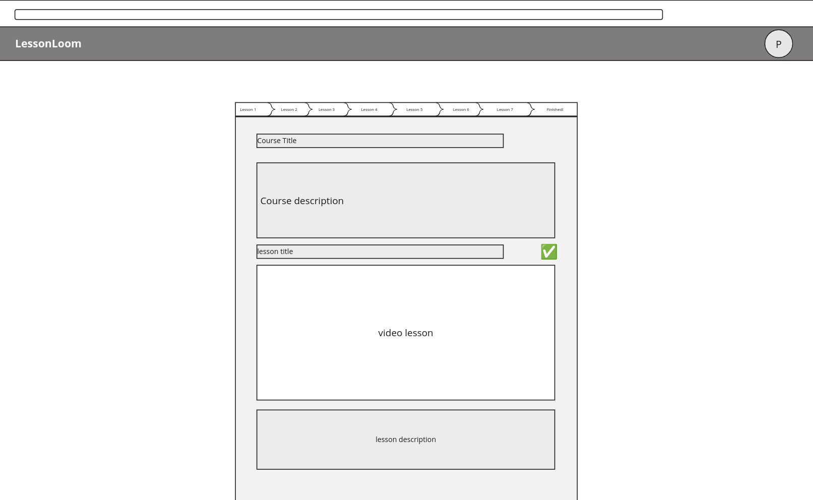
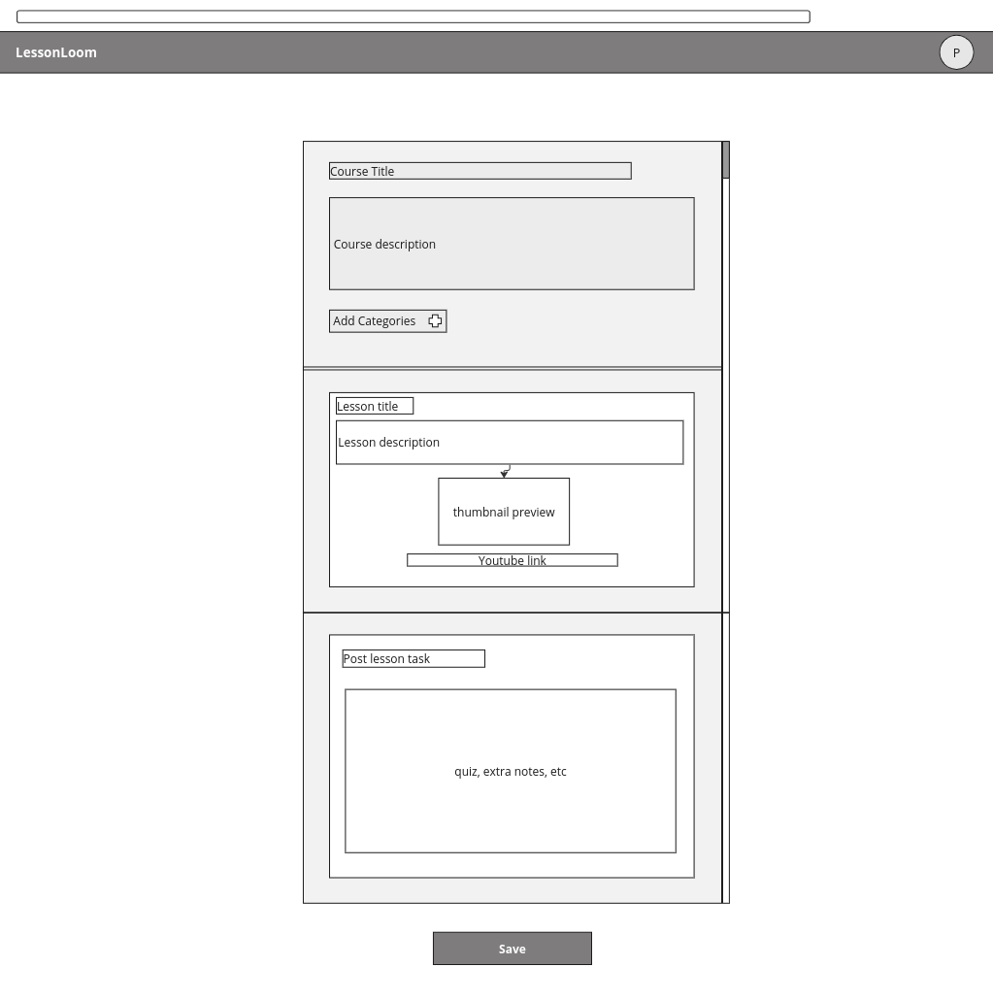
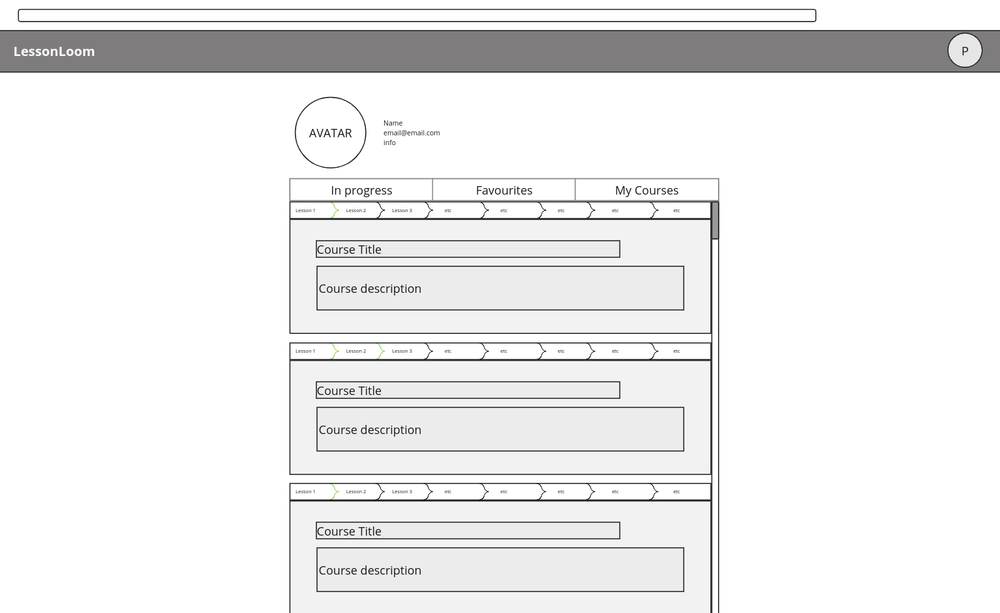
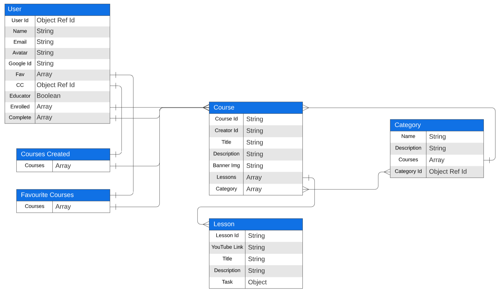
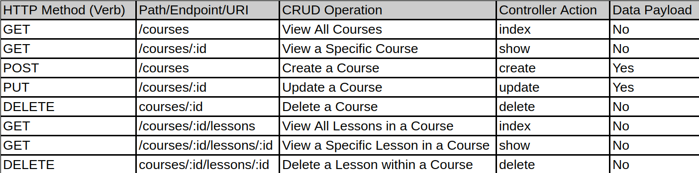

# LessonLoom

LessonLoom is an open source MERN stack application designed as a platform for students and educators to plan and consume curated lessons. Lessons can be arranged as a series of YouTube videos from one or more creators, which can then be viewed by anyone.

## Tech Stack
### Languages
- HTML
- CSS
- JavaScript
### Libraries/Frameworks
- Node.js: [https://nodejs.org/en](https://nodejs.org/en)
- Express.js: [https://expressjs.com/](https://expressjs.com/)
- React.js: https://react.dev/
- MongoDB: [https://www.mongodb.com/](https://www.mongodb.com/)
- Mongoose: [https://mongoosejs.com/](https://mongoosejs.com/)
### APIs
- Google API: [https://developers.google.com/identity](https://developers.google.com/identity)
- YouTube API: [https://developers.google.com/youtube/](https://developers.google.com/youtube/)
### Software
- VSCode: https://code.visualstudio.com/
- VSCodium: https://vscodium.com/
- LucidApp: https://lucid.app/
- Miro: https://miro.com/
- Figma: https://www.figma.com/
- Slack: https://slack.com/
- Zoom: https://zoom.us/
# Project Planning 

## Technologies Used:
### Languages:
- HTML
- CSS
- JavaScript
### Libraries/Frameworks:
- Node.js: [https://nodejs.org/en](https://nodejs.org/en)
- Express.js: [https://expressjs.com/](https://expressjs.com/)
- React.js: https://react.dev/
- MongoDB: [https://www.mongodb.com/](https://www.mongodb.com/)
- Mongoose: [https://mongoosejs.com/](https://mongoosejs.com/)
### APIs:
- Google IFrame: [https://developers.google.com/youtube/iframe_api_reference/](https://developers.google.com/youtube/iframe_api_reference)
### Software:
- VSCode: https://code.visualstudio.com/
- VSCodium: https://vscodium.com/
- Miro: https://miro.com/
- LucidApp: https://lucid.app/

## Features
- Login with Google
- Create courses
- Add lessons to courses
- Embbed YouTube links into lessons
- Store all course and lesson information in database
- Retrieve all course and lesson information in database
- Sort by category
- Access courses and lessons
- Conditional creator view of courses

## User View Wireframes
### Home Screen:

### Course Screen:

### Instructor Screen:

### Profile Screen:

## User Stories:
- As a student, I want to view and learn from a course on a topic of my interest.
- As a student, I want to be able to view courses via category
- As a student, I want to be able to see a progress bar on each course showing how much I have completed.
- As a student, I want to save courses I have completed to my profile along with saving other courses for later.
- As an educator, I want to create a lesson plan for my students to cohesively view and study.
- As an educator, I want to be able to add categories to my courses so it can appear in searches.
- As an educator, I want to be able to add YouTube videos and thumbnails of my choosing.
- As an educator, I want to create a lesson plan which include quizzes and questions based on the topics of the video.
- As an educator, I want to be able to edit and delete any courses I have created
- As a content creator, I want to relay my educational videos to LessonLoom to bring additional traffic to my videos.

## ERD Chart:

## RESTful Routing Chart:

## MVP
### To reach the minimum viable product, the project will:
- Authenticate and create accounts with Google accounts via OAuth
- Render login prompt screen if a user isn't logged in when attempting to use account-based features
- Embed a YouTube Iframe in the lesson screen
- Render upload screen with titles, links, descriptions, and thumbnail settings
- Render edit screen to change the aforementioned features in a user's course
- Connect to and update database with all of the app's entities
- Allow deletion of a user's own course
- Render home page with a list of courses to view
- Implement proper routing for courses and lessons
- Render a course page, where lessons can be selected and viewed
- Render a page for an individual lesson being viewed

## Stretch Goals:
- Non-Google OAuth authentication
- Non-OAuth authentication
- User Profile Page
- User Profile Picture Upload
- Visualize Course Progress
- Add Lesson Tasks (annotations, quizzes, notes)
- Newsfeed / Trending Courses
- Course Favoriting
- Course completion stats
- Assign tags a user's created courses
- Course filtering by tag
- Course length signifiers
- Course user rating system 
##
Abay Rysbek: https://github.com/ownerl \
Morgan Selbekk: https://github.com/mselbekk11 \
Carl Damey: https://github.com/carldamey
